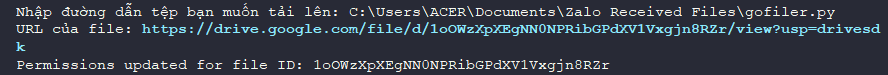
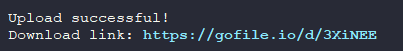

# File exchange - @T7C

Công cụ Python này cung cấp tính năng tải lên và tải về file giữa máy tính cá nhân và các nền tảng khác nhau. Nó có thể được mở rộng để làm việc với các dịch vụ lưu trữ đám mây như Google Drive, File.io, GoFile... hoặc bất kỳ giải pháp lưu trữ nào thông qua API tương ứng.

## Mục lục

1. [Cài đặt phụ thuộc](#cài-đặt-phụ-thuộc)
2. [Hướng dẫn sử dụng với Google Drive](#hướng-dẫn-sử-dụng-với-google-drive)
3. [Hướng dẫn sử dụng với GoFile](#hướng-dẫn-sử-dụng-với-gofile)

---

## Cài đặt phụ thuộc

Cài đặt các thư viện cần thiết:
```bash
pip install requests google-auth google-auth-oauthlib google-auth-httplib2 google-api-python-client
```

## Hướng dẫn sử dụng với Google Drive
1. Để sử dụng Google Drive API, bạn cần có khóa API. Truy cập vào [Google Cloud Console](https://console.cloud.google.com/) để tạo và tải về file JSON chứa khóa.

2. Đặt đường dẫn chính xác của file chứa khóa vào biến `SERVICE_ACCOUNT_FIL`E trong mã nguồn.

3. Thay thế biến `SERVICE_ACCOUNT_FILE` của bạn như dưới đây:
```bash
from google.oauth2 import service_account
from googleapiclient.discovery import build
from googleapiclient.http import MediaFileUpload


SERVICE_ACCOUNT_FILE = r'đường dẫn đến khóa .json'

SCOPES = ['https://www.googleapis.com/auth/drive']

credentials = service_account.Credentials.from_service_account_file(
    SERVICE_ACCOUNT_FILE, scopes=SCOPES)
service = build('drive', 'v3', credentials=credentials)

def upload_file(file_path):
    try:
        media = MediaFileUpload(file_path)
        request = service.files().create(
            media_body=media,
            body={
                'name': file_path.split('/')[-1],
                'mimeType': 'application/octet-stream'
            },
            fields='id, webViewLink'
        ).execute()
        file_id = request.get('id')
        web_view_link = request.get('webViewLink')
        return file_id, web_view_link
    except Exception as e:
        print(f'An error occurred: {e}')
        return None, None

def update_permissions(file_id):
    try:
        permission = {
            'type': 'anyone',
            'role': 'reader'
        }
        service.permissions().create(
            fileId=file_id,
            body=permission,
            fields='id'
        ).execute()
        print(f'Permissions updated for file ID: {file_id}')
    except Exception as e:
        print(f'An error occurred while updating permissions: {e}')


file_path = input('Nhập đường dẫn tệp bạn muốn tải lên: ')
file_id, url = upload_file(file_path)
if file_id and url:
    print('URL của file:', url)
    update_permissions(file_id)
else:
    print('Không thể tải tệp lên.')
```
hình ảnh minh họa


## Hướng dẫn sử dụng với GoFile
1. Cài thư viện requests bằng lệnh:
```bash
pip install requests
```
2. sử dụng mã dưới đây:
```bash
import requests

def upload_file(file_path):
    url = "https://store1.gofile.io/uploadFile"  
    files = {'file': open(file_path, 'rb')}
    
    try:
        response = requests.post(url, files=files)
        response.raise_for_status()
        response_json = response.json()
        if response_json.get("status") == "ok":
            print("Upload successful!")
            print("Download link:", response_json.get("data", {}).get("downloadPage"))
        else:
            print("Failed to upload file.")
            print("Error:", response_json.get("message"))
    except requests.exceptions.RequestException as e:
        print(f"Request error: {e}")
    except ValueError as e:
        print(f"Error decoding JSON response: {e}")


upload_file("C:/Users/ACER/Documents/Zalo Received Files/battery_log.csv") #thay thế bằng đường dẫn đến tệp của bạn

```
Hình ảnh minh họa



